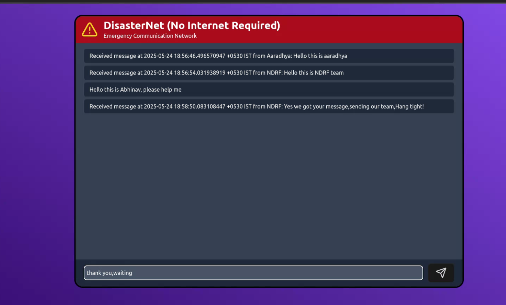

# RescueLink

 An offline-first, peer-to-peer emergency communication system built to communicate in disaster-prone areas where there is no connectivity to the internet.

**Demo video**
    
[outfile.webm](https://github.com/user-attachments/assets/7940c3cd-d245-44ee-961d-6ce7953df8fa)

## What's the need for this?
In areas hit with natural disasters tend to have no internet connectivity. Using this system, any number of devices (the rescue team or the civilians) can communicate with each other as long as they are connected to a same network via wifi/hotspot/ethernet LAN.

## How does this work?
It uses [libp2p-go](https://github.com/libp2p/go-libp2p) library to establish peer-2-peer connections.
Creates a Chat Room abstraction, allowing multiple users to communicate in the chat room.
Requires a known connection string or a roomName to be connected to the specific room.

Defined in /cmd/disasternet/main.go like this. 

```go
	roomFlag := flag.String("room", "chat-room", "name of chat room to join")
```
This shall be passed while running the node through the terminal(as of now)

## How does it discover peers/other devices if offline?
It uses **MDNS(Multicast DNS)** to discover peers in the same LAN network.
Its implementation is given in /cmd/internal/p2p/mdns.go

Brief explanation about MDNS
 
 > Multicast DNS (mDNS) is a computer networking protocol that resolves hostnames to IP addresses within small networks that do not include a local name server. It is a zero-configuration service, using essentially the same programming interfaces, packet formats and operating semantics as unicast Domain Name System (DNS).

 ## Files description
  - /cmd/disasternet/main.go :- Main file to create the host, discover peers and connect to them.
  - /cmd/disasternet/logs.txt :- Records all the messages,as a recovery backup.
  - /internal/p2p/host.go :- Creates the host on the specified port.
  - /internal/p2p/mdns.go :- MDNS implementation.
  - /internal/p2p/pubsub.go :- Implementation of ChatRoom and PubSub/topics by libp2p-go
  - /cmd/node/main.go :- File to initialise a host and connect to a peer address(used for testing).

## Frontend UI
 - Created using React
 - Can be used to send messages and receive via GUI.
 - Code can be found inside /frontend folder.
 

## Commands to run on your local system.

### Steps to start frontend
- Go to /frontend 
- Type commmand
```console
    npm install
    npm run dev
```

### Steps to start backend
- Go to /cmd/disasternet
- Info about flags-
- **port** :- Port where your host runs on.
- **same_string** :- Used by MDNS to discover peers wanting to connect with each other, this should be same among the peers.
- **nick** :- This will be your name displayed to all the peers connected.
- **room** :- Name of the room, this should be same among all the peers.
- **enable-http** :- Only run once while creating the host to setup backend api for frontend.
- Eg: Run command
```console
    go run main.go --port 9000 --same_string xyz --room myroom --nick Abhi --enable-http true
```
- Run command in another terminal/device connceted together via Wifi/Ethernet LAN to create another peer.
```console
go run main.go --port 9001 --same_string xyz --room myroom --nick Aaradhya
```
- Start communicating by sending messages by writing through terminal or though the frontend Ui.

Created by - [Abhinav Jha](https://x.com/AbhinavXJ)
